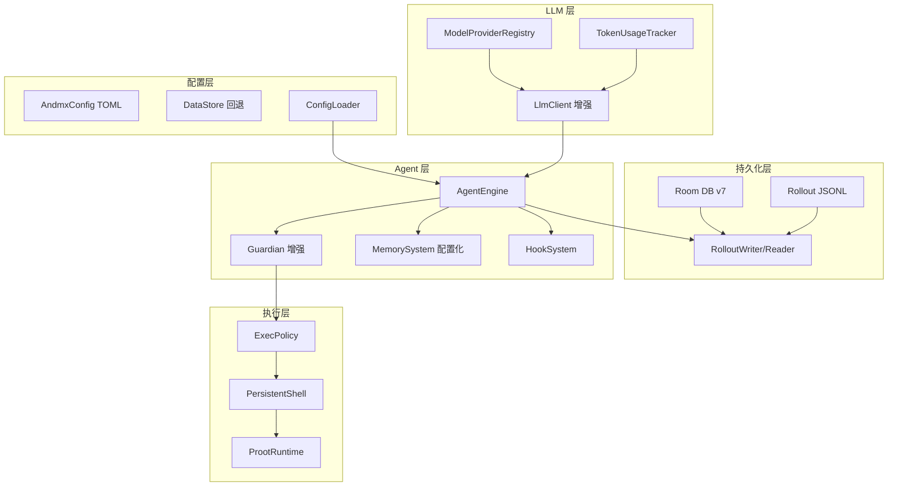

## 用户需求

用户要求逆向分析 Codex.app 更多基础设施细节，并将发现转化为 AndMX 的实际改进。核心目标是让 AndMX 在基础设施深度上对标 Codex，做到不仅是功能列表对齐，而是底层机制完整移植。

## 逆向分析发现的关键基础设施差距

基于对 Codex 225MB Rust 二进制的 strings 提取、`~/.codex/config.toml` 实际配置、SQLite schema、rollout JSONL 文件格式、Electron asar 解包的全面分析，发现以下 8 个关键基础设施差距：

1. **会话持久化**: Codex 使用 JSONL rollout 文件（每行含 timestamp/type/payload 的 session_meta/event_msg/response_item/turn_context），AndMX 仅用 Room 存消息文本，缺少轮次上下文快照和会话元数据
2. **数据库 Schema**: Codex 有 threads/thread_goals/thread_spawn_edges/thread_dynamic_tools/logs(FTS) 等 8+ 张表，AndMX 仅 2 张表
3. **多 Provider/Wire API**: Codex 支持 responses/responses_websocket/chat_completions 三种 wire_api + 多 provider + 重试恢复 + rate limit 感知 + token 用量统计，AndMX 仅单 provider + HttpURLConnection
4. **Config 系统**: Codex 用 TOML 配置含 60+ 字段 + 项目信任级别 + 多 profile + config lock，AndMX 用 DataStore preferences 约 10 个字段
5. **Guardian 审批**: Codex 有 execve/applyPatch/networkAccess/mcpToolCall/requestPermissions 五种动作类型 + managed filesystem permissions + glob_scan，AndMX 仅正则匹配
6. **记忆配置**: Codex 有 extract_model/consolidation_model/max_raw_memories_for_consolidation 等 12 个配置项，AndMX 硬编码阈值
7. **Skill 系统**: Codex 有 SKILL.md frontmatter + curated skills + plugin.json 验证 + marketplace，AndMX 的 PluginSystem 仅发现不验证
8. **遥测/日志**: Codex 有 OpenTelemetry + Sentry + tracing spans + logs 表(FTS)，AndMX 无遥测

## 产品概述

将 Codex 的基础设施层系统性地移植到 AndMX，覆盖持久化层升级、多 Provider LLM 层、TOML 配置系统、增强 Guardian 审批、记忆配置化、Skill 验证和遥测基础。

## 技术栈

- 语言: Kotlin 2.0.20 + C (JNI)
- UI: Jetpack Compose + Material3 (AndmxTheme)
- DI: Hilt 2.51.1
- 持久化: Room 2.6.1 (SQLite) + DataStore Preferences
- 网络: kotlinx.serialization 1.7.1 + HttpURLConnection (SSE)
- 异步: kotlinx.coroutines 1.8.1
- 构建: Gradle KTS + Version Catalog, AGP 8.5.2
- NDK: arm64-v8a only, CMake 3.22.1

## 实现方案

### 1. 持久化层升级 — Rollout JSONL + Room Schema 扩展

**Rollout JSONL 系统** (`data/rollout/`):

- 新建 `RolloutWriter.kt` — 在每个 AgentEvent 发生时写入 JSONL 行（session_meta → turn_context → response_item → event_msg），文件存储在 `context.filesDir/rollouts/rollout-<timestamp>-<uuid>.jsonl`
- 新建 `RolloutReader.kt` — 从 JSONL 文件恢复完整会话状态（包括 turn_context 中的 approval_policy/sandbox_policy/model/personality）
- 在 `ConversationController` 中集成：每次 turn 开始写 session_meta + turn_context，每个 AgentEvent 写 response_item/event_msg
- 会话恢复时优先从 rollout 文件加载（比 Room 消息更完整），Room 作为索引和搜索层

**Room Schema 扩展** (v6 → v7):

- `conversations` 表新增字段: `rolloutPath`, `sandboxPolicy`, `model`, `reasoningEffort`, `memoryMode`, `firstUserMessage`, `archived`
- 新增 `thread_goals` 表: thread_id(PK), goal_id, objective, status(active/paused/blocked/usage_limited/budget_limited/complete), token_budget, tokens_used, time_used_seconds, created_at_ms, updated_at_ms
- 新增 `thread_spawn_edges` 表: parent_thread_id, child_thread_id, status (子代理关系图)
- 新增 `logs` 表: thread_id, ts, ts_nanos, id, process_uuid, estimated_bytes, content — 带 FTS 虚拟表用于全文搜索
- 迁移 MIGRATION_6_7

### 2. 多 Provider LLM 层

**Provider 模型** (`llm/provider/`):

- 新建 `ModelProvider.kt` — data class: name, base_url, wire_api (responses/chat_completions), requires_openai_auth, env_key, http_headers, bearer_token_env_var, request_max_retries, stream_max_retries, stream_idle_timeout_ms, websocket_connect_timeout_ms, supports_websockets
- 新建 `ModelProviderRegistry.kt` — 内置 OpenAI/Ollama/LMStudio/DeepSeek 预设 + 用户自定义 provider
- 升级 `ProviderSettings.kt` — 增加 `modelProvider`, `modelContextWindow`, `reviewModel`, `modelReasoningSummary`, `modelVerbosity` 字段

**LlmClient 增强**:

- 新增 Responses API 支持（`/responses` 端点，与 `/chat/completions` 并行支持）
- 新增请求头: `x-client-request-id`, `x-codex-installation-id`, `x-codex-turn-state`, `OpenAI-Beta`
- 新增重试逻辑: request_max_retries + stream_max_retries，exponential backoff
- 新增 token 用量统计: 从响应中提取 input_tokens/cached_input_tokens/output_tokens/reasoning_output_tokens/total_tokens，通过 StateFlow 暴露
- 新增 rate limit 感知: 解析响应头中的 rate limit 信息，暴露 rate_limit_remaining

### 3. TOML 配置系统

**TOML 解析** (`config/`):

- 新建 `AndmxConfig.kt` — 对标 Codex 的 ConfigToml，包含 60+ 字段
- 新建 `ConfigLoader.kt` — 从 guest 文件系统 `/root/.andmx/config.toml` 加载 + DataStore 回退 + 环境变量覆盖
- 新建 `ProjectTrust.kt` — 项目信任级别管理 (trusted/untrusted)，存储在 config.toml `[projects]` section
- 新建 `ConfigLock.kt` — config.lock 文件防止并发修改
- 在 `ConversationController` 中用 ConfigLoader 替代直接 DataStore 读取

### 4. Guardian 增强

**增强 Guardian** (`agent/`):

- 扩展 `Guardian.kt` — 新增 ActionType 枚举 (EXECVE/APPLY_PATCH/NETWORK_ACCESS/MCP_TOOL_CALL/REQUEST_PERMISSIONS)
- 新建 `ManagedFileSystemPermissions.kt` — restricted (entries + glob_scan_max_depth) / unrestricted 两种模式
- 新建 `PermissionProfile.kt` — AdditionalPermissionProfile 叠加层，会话级授权
- 集成 PermissionRequest hook 到 approveGate
- 改进 rm -rf 风险评估：先 read-only 检查目标路径，小文件/空目录降级为 low/medium

### 5. 记忆配置化

**MemoryConfig** (`agent/memory/`):

- 新建 `MemoryConfig.kt` — generate_memories, use_memories, dedicated_tools, max_raw_memories_for_consolidation, max_unused_days, max_rollout_age_days, max_rollouts_per_startup, min_rollout_idle_hours, min_rate_limit_remaining_percent, extract_model, consolidation_model, disable_on_external_context
- 从 TOML 配置加载，替代 MemorySystem 中的硬编码常量
- 集成 rate limit 感知：rate_limit 不足时跳过记忆提取

### 6. Skill 验证 + Plugin 增强

**Skill 系统** (`agent/plugins/`):

- 新建 `SkillValidator.kt` — 验证 SKILL.md frontmatter (name/description/enabled)，验证 plugin.json (name/version/interface.capabilities/interface.screenshots/interface.brandColor)
- 新建 `SkillInstaller.kt` — 从 git/marketplace 安装 skill 到 `/root/.andmx/skills/`
- 增强 `PluginSystem.kt` — 添加 plugin.json 验证 + marketplace 列表 + plugin 分享

### 7. 遥测基础

**遥测层** (`telemetry/`):

- 新建 `TelemetrySink.kt` — 轻量级遥测接口（不依赖 OpenTelemetry SDK），记录 span/事件到 logs 表
- 新建 `TokenUsageTracker.kt` — 追踪每轮 token 用量，写入 logs 表 + StateFlow 暴露
- 在 AgentEngine loop 中注入 tracing spans（turn_start → llm_request → tool_execution → turn_end）

## 实现注意事项

- Room 迁移必须向前兼容：v6→v7 仅为新增字段和表，不修改已有列
- TOML 配置文件不存在时回退到 DataStore 默认值，不阻塞启动
- Rollout JSONL 写入使用 append-only 模式，单线程写入避免并发问题
- LlmClient 的 Responses API 支持作为可选路径，通过 wire_api 配置切换，默认仍用 chat_completions
- Guardian 的 PermissionRequest hook 在 fail-open 模式下运行（hook 超时不阻塞工具执行）
- 日志 FTS 虚拟表使用 SQLite FTS4（Room 兼容性更好，FTS5 在部分旧设备上不可用）

## 架构设计



## 目录结构

```
app/src/main/java/com/andmx/
├── agent/
│   ├── Guardian.kt                    [MODIFY] 增加 ActionType, 改进 rm -rf 评估
│   ├── memory/
│   │   ├── MemorySystem.kt            [MODIFY] 从 MemoryConfig 加载阈值
│   │   └── MemoryConfig.kt            [NEW] 12 个记忆配置项
│   └── plugins/
│       ├── PluginSystem.kt            [MODIFY] 添加验证调用
│       ├── SkillValidator.kt          [NEW] SKILL.md + plugin.json 验证
│       └── SkillInstaller.kt          [NEW] git/marketplace 安装
├── config/                             [NEW PACKAGE]
│   ├── AndmxConfig.kt                 [NEW] 60+ 字段 TOML 配置模型
│   ├── ConfigLoader.kt                [NEW] TOML 加载 + DataStore 回退
│   ├── ProjectTrust.kt                [NEW] 项目信任级别
│   └── ConfigLock.kt                  [NEW] 配置锁
├── data/
│   ├── Entities.kt                    [MODIFY] 新增字段 + 3 个新 Entity
│   ├── AndmxDao.kt                    [MODIFY] 新增 DAO 方法
│   ├── AndmxDatabase.kt               [MODIFY] v6→v7 迁移
│   ├── ConversationRepository.kt      [MODIFY] 新增方法
│   └── rollout/                        [NEW PACKAGE]
│       ├── RolloutWriter.kt           [NEW] JSONL 追加写入
│       ├── RolloutReader.kt           [NEW] JSONL 恢复
│       └── RolloutModels.kt           [NEW] session_meta/turn_context/response_item 模型
├── llm/
│   ├── Models.kt                      [MODIFY] 增加 Responses API 请求/响应模型
│   ├── LlmClient.kt                   [MODIFY] 重试/请求头/token 统计
│   ├── StreamModels.kt                [MODIFY] 增加 Responses API 流式模型
│   └── provider/                      [NEW PACKAGE]
│       ├── ModelProvider.kt           [NEW] provider 配置模型
│       └── ModelProviderRegistry.kt   [NEW] 内置预设 + 用户自定义
├── settings/
│   └── ProviderSettings.kt            [MODIFY] 增加 modelProvider/contextWindow/reviewModel 等
├── telemetry/                         [NEW PACKAGE]
│   ├── TelemetrySink.kt               [NEW] 轻量遥测接口
│   └── TokenUsageTracker.kt           [NEW] token 用量追踪
└── ui/conversation/
    └── ConversationController.kt      [MODIFY] 集成 rollout/config/telemetry
```

## Agent Extensions

### SubAgent

- **code-explorer**
- Purpose: 在实现阶段并行探索多个文件，验证集成点的 API 兼容性
- Expected outcome: 确认所有修改文件的接口签名正确，无编译冲突

---

## 第二轮深度逆向 — 新发现的基础设施 (2026-06-18)

### 逆向发现

基于对 Codex 225MB Rust 二进制的进一步 `strings` 提取和 `~/.codex/` 目录分析，发现以下尚未覆盖的基础设施：

1. **Context Checkpoint Compaction** — Codex 有专门的 "CONTEXT CHECKPOINT COMPACTION" 模式，用于跨会话/跨代理的完整上下文交接，而非仅自动压缩。源码路径 `core/src/compact_remote_v2.rs`。
2. **Session Resume + Token Usage Replay** — 从 rollout JSONL 完全恢复会话状态，包括 token 用量回放。源码路径 `cli/src/state_db_recovery.rs`, `app-server/src/request_processors/token_usage_replay.rs`。
3. **Session Index** — `~/.codex/session_index.jsonl` 索引文件，每行 `{"id","thread_name","updated_at"}`，支持快速会话列表/搜索。
4. **Models Cache** — `~/.codex/models_cache.json` (177KB)，缓存模型元数据（context window、定价、能力）。
5. **Git Baseline Repo** — Codex 维护独立的 git baseline 仓库，用于准确 diff 生成和回滚。`gitInfo.sha/branch/originUrl` 结构。
6. **Shell Snapshots** — `~/.codex/shell_snapshots/` 目录，捕获/恢复 shell 环境（cwd、env、aliases）。
7. **Ambient Suggestions** — `~/.codex/ambient-suggestions/` 目录，后台主动建议系统。
8. **Automations** — `~/.codex/automations/` 目录，用户定义的定时/触发式自动化任务。
9. **MCP HTTP/SSE Transport** — 除 stdio 外，Codex 支持 HTTP/SSE 传输连接远程 MCP 服务器。
10. **Multi-Agent v2 API** — 完整的 spawnAgent/resumeAgent/waitAgent/closeAgent 生命周期。
11. **SQLite 多数据库** — `goals_1.sqlite`(32KB), `logs_2.sqlite`(481MB), `memories_1.sqlite`(40KB), `state_5.sqlite`(1.87MB) 分别存储不同数据。
12. **Startup Prewarm** — `startup_prewarm_create_turn_context`, `startup_prewarm_build_tools`, `startup_prewarm_build_prompt`, `startup_prewarm_websocket_warmup` 性能优化。

### 新建文件

| 文件 | 说明 |
|------|------|
| `data/rollout/SessionResumer.kt` | 从 rollout JSONL 恢复完整会话状态 + token 回放 + 崩溃恢复 |
| `data/rollout/SessionIndex.kt` | 维护 session_index.jsonl 索引 + 搜索/归档 |
| `llm/ModelsCache.kt` | 本地模型元数据缓存 + 15 个内置模型预设 |
| `workspace/GitBaseline.kt` | Git baseline repo + diff/reset/commit + gitInfo 收集 |
| `exec/ShellSnapshots.kt` | Shell 环境快照（cwd/env/aliases/functions）+ 恢复 |
| `agent/suggestions/AmbientSuggestions.kt` | 后台主动建议（git/build/context/idle） |
| `agent/automations/AutomationSystem.kt` | 定时/触发式自动化（interval/cron/event/pressure/idle） |
| `mcp/McpHttpTransport.kt` | MCP HTTP/SSE 传输层 |

### 修改文件

| 文件 | 变更 |
|------|------|
| `agent/ContextCompactor.kt` | 新增 createCheckpoint() 上下文检查点交接 + CompactionEvent 遥测 + autoCompactTokenLimit 配置化 |
| `agent/multi/SubAgentOrchestrator.kt` | 新增 resume/wait/close/listAgents + AgentState 状态机 + spawnAsync + MultiAgentControlTool |
| `mcp/McpManager.kt` | 支持 HTTP/SSE 传输 + 资源订阅 + listAllResources + refreshSubscriptions |
| `mcp/McpProtocol.kt` | (已有) 完整 MCP 方法常量 + McpTransport 枚举 |